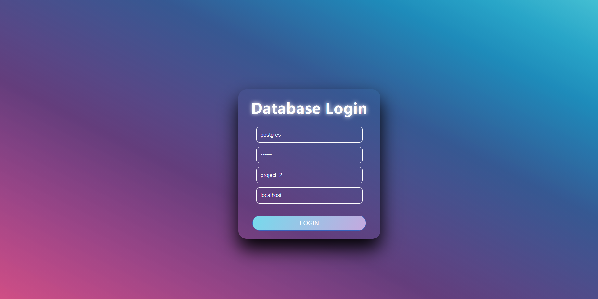

## DB project 2

12010641 牛景萱

12012427 黄柯睿

### Bonus：

### 1. Design system functional requirements API.

1. Based on the actual requirements, we design the functions as follows

- get_enterprise_order : Retrieve and view all orders of a certain customer company, so that we can analyze customer needs and provide better services to customers.

- get_center_stock: Retrieve the model, stock, price and total sales of a supply center's products, so that the supply center can restock and adjust the price in time.

We show the result of running function execution through **RESTful** API, and change the URL to realize conditional query and multi-conditional query.


2. We have also designed a trigger.

- contract_type_trigger: when inserting order records into the orders table orders, it automatically completes the order status according to *estimate_delivery_date, lodgement_date* and the current system time *current_date*: finished / unfinished. unfinished. 3.

3. Considering that the company needs to adjust the listed products according to the market and market dynamics, we designed the trigger for **change** or **delete** the product table.

```postgresql
create trigger product_update_trigger
    before update
    on project_2.public.product
    for each row
execute procedure product_check();

create trigger product_delete_trigger
    before delete
    on project_2.public.product
    for each row
    execute procedure product_delete_check();
```

- product_update_check(): Ensure that when the product information in the product table is changed, the updated information is synchronized with the order and inventory tables.
- product_delete_check(): Ensure that when a product is deleted, the product information in the inventory table is also deleted.

### 2.Index：

​	Ⅰ. We try to create indexes on the product_model, contract_manager and salesman_num columns of orders for the following reasons.

1. product and staff are the "base tables" in the given situation, which are less involved in change operations and more frequently used as query conditions. 2.

The orders table is a dependent table of the staff and product tables. orders table's product_model, contract_manager and salesman_num columns are foreign key columns.

   > If the slave table does not have an index containing a foreign key column, SQL Server needs to scan the entire slave table. The larger the slave table, the longer it takes to perform operations such as delete updates. It also tends to cause blocking in high concurrency situations. If the master table has uniquely aggregated or non-aggregated indexes, you can use the indexes of the master table to quickly locate them when inserting or modifying from the slave table.

3. Each order in orders, once formed and added to the order information, is not easily involved in update operations in reality.

```postgresql
--btree 对文本模糊匹配表现更好
CREATE INDEX product_index ON project_2.public.orders USING btree(product_model);
explain select * from  project_2.public.orders where product_model like 'Photo%';
--hash 适用于等值匹配
CREATE INDEX salesman_index ON project_2.public.orders using hash(salesman_num); 
CREATE INDEX manager_index ON project_2.public.orders using hash(contract_manager);
explain select * from project_2.public.orders where orders.salesman_num = '11110405';
```

Ⅱ. For stock tables, create expression indexes to make it easier to search for products based on the number of sales.

```postgresql
CREATE INDEX sales_num_index ON stock ((stock.quantity-stock.current_quantity));
explain select * from  stock where stock.quantity-stock.current_quantity between 0 and 10;
```


[^Search efficiency before and after adding indexes]: 10.72-->7.97


[^Search efficiency before and after adding indexes]: 15.61 --> 8.02

### 3.Role：

Based on the actual requirements, in addition to superuser postgres, we have created the following three new Roles

- product_manager, which manages product information, has all the permissions of the product table.
- database_manager that manages database instead of superuser: has the permission to create database and create users
- xxx_center_manager which manages the xxx supply center: has all permissions for the product inventory view of the supply center and the employee information view of the supply center


America_center_manager example：


### 4. web

This front-end we mainly implement two pages, one is the login page, used for user authentication, and one is the database management page

The following are screenshots of the two pages.

login interface:



database interface：


During login verification, the user needs to enter four pieces of information: user name, password, database and host address. After the user enters the correct information, the backend will connect to the database and initialize the database connection pool for later use.

**The operations supported by the front-end are**.

1. one-click import operation
2. one-click export operation (save query results as txt files)
3. Q6-Q13 query operation
4. Q12-Q13 auto-completion (input part of the characters can automatically complete the rest of the characters)
5. panel clearing operation (only clear the front-end display, will not clear the back-end query results)
6. manually enter SQL statements and print the execution results to the workbench (if it is a select statement)

### 5.Database connection pooling

The connection pool we use for this database is PooledDB under the DBUtils package of python

```python
pool = PooledDB(
    creator=pg,
    mincached=1,
    maxcached=20,
    blocking=True,
    port=5432,
    database='project_2',
    user='postgres',
    password='123456',
    host='localhost',
    ping=0
)
```

The initial connection is set to 1, the maximum connection is set to 20, and blocking is set to True

For a single server, we also implement a caching feature: that is, if a client repeatedly requests the same content from the server, it reads it from the cache instead of requesting a connection from the data. Caching greatly enhances the database's ability to handle highly concurrent single queries.


### 6. server

The backend supports http connection and RESTful service, http connection is used for front and backend interaction, RESTful service is used for some complex queries, and then the backend uses psycopg2 to connect to the database

The successful run screen looks like this.


The result of processing the request when it is encountered is as follows.


### 7. Server Distribution：

#### 1. Using Citus, a distributed middleware for PostgreSQL databases

We first consider using Citus to solve the PostgreSQL horizontal scaling problem to support larger data volumes and greater write and query performance.

We deploy citus (with citus extensions installed) on two separate Linux systems (wsl) on two hosts with the add node bit local IP.

On each node, open port 5432.


Since the IP of wsl is the local IP, and the local IP belongs to the campus network intranet IP, which is not a static IP, NAT network address translation and port mapping should be considered for deployment. It enables two hosts (servers) to communicate with each other, thus realizing the distribution. The specific implementation can be configured in docker, here we understand the concept without specific implementation.

#### 2. Manual implementation of simple server distribution

Since the one above requires a public IP, or a cloud server, and since the network segment where we use wsl is our computer's subnet, not under the campus network's subnet, it is not possible to bind the campus network's IP, and the IP assigned to us by our campus network server is dynamically changed over time, it will be inconvenient to switch. So we finally gave up the above distributed design and we are going to implement our own distributed manually.

Our idea is to open a separate proxy.py as a proxy server, which maintains a list of servers, and when there is a query result, select a server from the server list to query and return the query result, and when there is a need to make changes (such as update, delete, etc.), all the servers need to be changed. The advantage of doing this is to reduce the pressure on the server caused by high concurrency and to avoid query failure caused by a single server going down. The IP bound to the proxy server is the campus network IP, so as long as the device and the proxy server are under the same subnet (i.e. campus network), they can be used as servers.

### 8. Stress test:

For this part of stress testing we use Jmeter software under Apache for stress testing. The software is written on java.

The final number of threads we chose to test was.

1server (no distribution): 400 threads, 600 threads, 800 threads, 1000 threads

2server: 1000 threads, 1200 threads, 1400 threads, 1600 threads, 1800 threads

#### The results at 1server are as follows:

400 threads：


600 threads：


800 threads：


1000 threads：


As you can see, from 600 threads onwards, the server's processing power starts to drop and packet loss starts to occur, and by 1000 threads, the server is already very laggy and eventually has a 34% exception

#### 2server时结果如下：

1000 threads：


1200 threads：


1400 threads：


1600 threads：


1800 threads：


As you can see, with just two servers after using distributed, it is already easy to handle 1000 threads without errors.

The packet loss only starts at 1200 threads, and at 1800 threads there are only about 15% exceptions and no significant lag. You can see that the efficiency of distributed optimization for queries is exponentially increased

Here is a graph based on the exception rate.


Extends: Add cache stress test (2000 threads) with no error.


