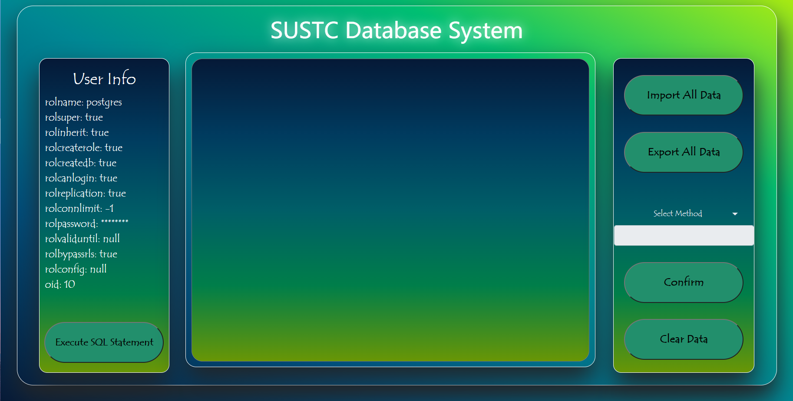

# 前端

此次前端我们主要实现两个页面，一个是登录页面，用于用户验证，一个是数据库管理页面

以下是两个页面的截图

login界面：


database界面：



在登录验证时，用户需要输入四项信息，分别是：用户名，密码，数据库以及主机地址，在用户输入正确的信息之后，后端将会连上数据库并初始化数据库连接池，以便之后使用

前端支持的操作有：

1. 一键导入操作
2. 一键导出操作（将查询结果保存为txt文件）
3. Q6-Q13的查询操作
4. Q12-Q13的自动补全（输入一部分字符可以自动补全其余字符）
   5. 面板清空操作（只是清空前端显示，不会清空后端的查询结果）
6. 手动输入SQL语句，并将执行结果打印到工作台中（如果是select语句的话）

# 数据库连接池

本次数据库我们所使用的的连接池是python的DBUtils包下的PooledDB

```python
pool = PooledDB(
    creator=pg,
    mincached=1,
    maxcached=20,
    blocking=True,
    port=5432,
    database='project_2',
    user='postgres',
    password='123456',
    host='localhost',
    ping=0
)
```

初始连接设置为1，最大连接设置为20，blocking设置为True

# 后端

后端支持http连接和RESTful服务，http连接用于前后端交互，RESTful服务用于一些复杂查询，然后后端利用psycopg2来连接数据库

运行成功的画面是这样：


遇到请求时处理结果如下：


